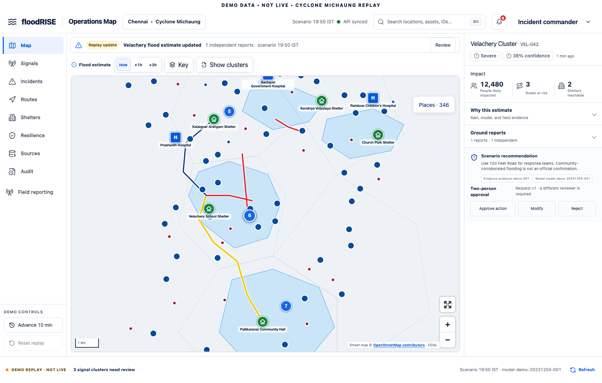
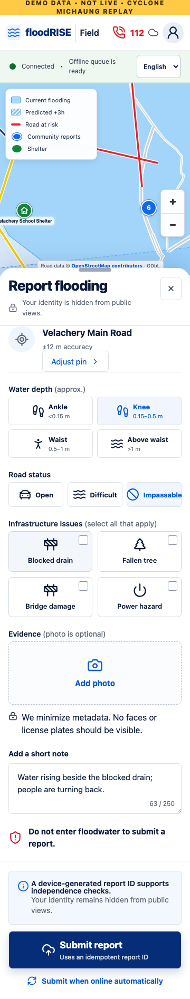

# floodRISE

**Flood intelligence, community reporting, and human-reviewed response workflows for Indian cities.**

[](https://github.com/robinfrancis186/floodRISE/actions/workflows/ci.yml)
[](https://github.com/robinfrancis186/floodRISE/actions/workflows/security.yml)

[Explore the operations console](https://floodrise.vercel.app/) · [Open the field PWA](https://floodrise.vercel.app/field/) · [Run locally](#quick-start) · [Contribute](CONTRIBUTING.md)

> **Current status: demonstration MVP.** Flood estimates, alerts, routes, and approval workflows use a deterministic Chennai Cyclone Michaung replay. Kerala provides real community-mapped geographic locations, with unverified availability and access. The public deployment has no connected backend or identity provider and cannot save API-dependent decisions. It is not an activated emergency service.



## What you can do

| Product | Features |
| --- | --- |
| **Operations console** | Explore impact estimates, review community evidence, inspect incidents and shelters, rehearse lower-risk routing and two-person approvals, inspect source health, and review audit records. |
| **Field PWA** | Choose a report pin or edit coordinates, submit observations and private photo evidence to the local API, queue encrypted drafts offline, inspect receipts, and browse helplines. |
| **Detailed maps** | Direct OpenStreetMap street tiles, clustered facility markers, name search, category filters, source-record links, and nearest-to-map-centre lists. |
| **Geographic coverage** | 637 packaged Chennai and 23,586 Kerala OSM facility records: hospitals, police, fire stations, schools, colleges, and community centres. Only Chennai has a flood scenario. |

Use **Places → Region → Kerala statewide** in either main map to explore Kerala. Select a grouped blue dot to zoom in; select a place to inspect its OSM record. Schools and halls are not automatically relief camps, and straight-line distance is not a travel route.

The installed field PWA caches the Kerala facility snapshot after its first successful download. Street tiles are not bulk-downloaded or guaranteed offline; the packaged Chennai road map supplies a fallback when tiles fail. All incident reporting and alert workflows still target the Chennai replay.

<details>
<summary>Field reporting preview</summary>



</details>

## Quick start

### Requirements

- Node.js **22** and pnpm **11.7.0** (the version in `package.json`).
- Python **3.12 or newer** and `uv`.
- Docker Compose v2 only for the optional container services.

```bash
git clone https://github.com/robinfrancis186/floodRISE.git
cd floodRISE
pnpm install --frozen-lockfile
uv sync --project services/backend --frozen
pnpm dev
```

The default demo uses SQLite and packaged fixtures; Docker and live-provider credentials are not required. The API initializes and seeds its demo repository on startup.

| Local surface | URL |
| --- | --- |
| Operations console | [localhost:5173](http://localhost:5173) |
| Field app | [localhost:5174](http://localhost:5174) |
| API documentation | [localhost:8787/docs](http://localhost:8787/docs) |
| API health | [localhost:8787/health](http://localhost:8787/health) |

The development apps proxy `/api` to port 8787. See [.env.example](.env.example) for configuration names and [deployment setup](docs/DEPLOYMENT.md) for protected builds. Never place server credentials in `VITE_*` values.

For a containerized demo API with PostgreSQL/Valkey, run these in separate terminals instead of `pnpm dev`:

```bash
# Terminal 1: starts the API and its dependencies
docker compose -f infra/compose.yaml --profile api up -d --build backend
# Terminal 2
pnpm dev:ops
# Terminal 3
pnpm dev:field
```

See the [demo runbook](docs/DEMO_RUNBOOK.md) for report corroboration, approval rehearsal, and an explicit per-browser reset.

## Repository map

| Path | Responsibility |
| --- | --- |
| [`apps/ops-web`](apps/ops-web) | React operations console with eight main views. |
| [`apps/field-web`](apps/field-web) | React field PWA, encrypted local queue, and report workflows. |
| [`services/backend`](services/backend/README.md) | FastAPI, SQLAlchemy/Alembic, evidence rules, reference routing, approvals, SSE, and audit. |
| [`services/tile-api`](services/tile-api/README.md) | Allow-listed tile facade for checksum-pinned demo depth grids. |
| [`packages/map`](packages/map/README.md) | Shared MapLibre maps, facility search, basemap fallback, and report pins. |
| [`packages/ui`](packages/ui) | Shared UI primitives and design tokens. |
| [`packages/contracts`](packages/contracts) / [`packages/api-client`](packages/api-client/README.md) | Zod contracts and generated OpenAPI client. |
| [`fixtures`](fixtures) | Deterministic Chennai scenario and attributed OSM geographic snapshots. |
| [`infra`](infra/README.md) / [`ops`](ops/README.md) | Local services, un-applied AWS scaffold, monitoring configuration, and runbooks. |

## Development commands

```bash
# Install the second Python service before running the full checks
uv sync --project services/tile-api --frozen

pnpm test             # Web/Python units, fixtures, and API contract drift
pnpm typecheck        # TypeScript workspace checks
pnpm lint             # TypeScript and Python checks
pnpm format:check     # Python formatting checks
pnpm build:release    # Combined web release: / and /field/

# Separate browser checks (first install Chromium)
pnpm exec playwright install chromium
pnpm test:e2e
```

Playwright launches test web servers and a built PWA preview; it reuses an existing API on port 8787 locally if one is running. Use a demo API and synthetic data. Browser evidence is written under `artifacts/`. See [quality gates](docs/QUALITY_GATES.md) for CI coverage and manual release checks.

## Deployment and readiness

```bash
pnpm build:release
vercel --prod
```

The checked-in Vercel configuration serves operations at `/` and the field PWA at `/field/`, with independent assets, scoped service-worker caching, and security headers. Vercel hosts the web products; the FastAPI service, database, object storage, and malware scanner require separate hosting.

**Operational activation remains unfinished:** durable PostgreSQL/private object storage, a real OIDC client and enrolled users, a live scanner, approved source ingestion, live incident workflows, operational routing, and authorized notification delivery. Terraform is a target scaffold, not a deployed system. Current approval dispatch is synthetic, and model output is not certified flood guidance.

Read [implementation status](docs/IMPLEMENTATION_STATUS.md) and [deployment setup](docs/DEPLOYMENT.md) before enabling a protected deployment. The [7 October release record](docs/RELEASE_VERIFICATION_2026-10-07.md) separates verified behavior from external activation work.

## Documentation

| Start here | Details |
| --- | --- |
| [Architecture](docs/ARCHITECTURE.md) | Services, contracts, and data flow. |
| [Implementation status](docs/IMPLEMENTATION_STATUS.md) | Implemented features and remaining work. |
| [Demo runbook](docs/DEMO_RUNBOOK.md) | Rehearsal, reset, and offline journeys. |
| [Deployment setup](docs/DEPLOYMENT.md) / [deployment runbook](docs/DEPLOYMENT_RUNBOOK.md) | Web hosting, protected configuration, and release procedures. |
| [Data sources](docs/DATA_SOURCES.md) / [India profile](docs/INDIA.md) | Provenance, geographic coverage, helplines, and languages. |
| [Safety](docs/SAFETY.md) / [privacy and retention](docs/PRIVACY_RETENTION.md) | Authority boundaries and evidence handling. |
| [Quality gates](docs/QUALITY_GATES.md) / [latest verification](docs/RELEASE_VERIFICATION_2026-10-07.md) | Automated checks and evidence limitations. |
| [Open-source stack](docs/OPEN_SOURCE_STACK.md) / [design system](docs/DESIGN_SYSTEM.md) | Dependencies and interface conventions. |
| [Incident response](docs/INCIDENT_RESPONSE.md) / [observability](docs/OBSERVABILITY_RUNBOOK.md) | Operational procedures and monitoring. |

## Data attribution and licensing

OpenStreetMap data is distributed under **ODbL 1.0**, credited to **© OpenStreetMap contributors**. See [Chennai data licences](fixtures/chennai-demo/LICENSES.md), the [Kerala snapshot](fixtures/regions/in-kl/README.md), and the [map package](packages/map/README.md) for provenance and tile-service constraints. Third-party components retain their respective licences.

This repository does **not currently declare a licence for its own application source**. Public access does not itself grant an open-source licence; do not assume redistribution rights from the OSM data licence.
