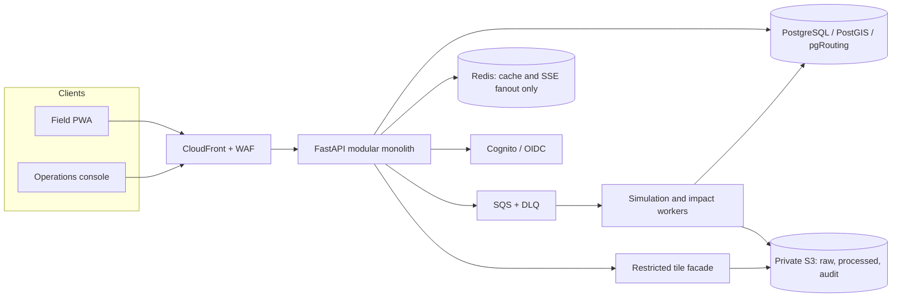
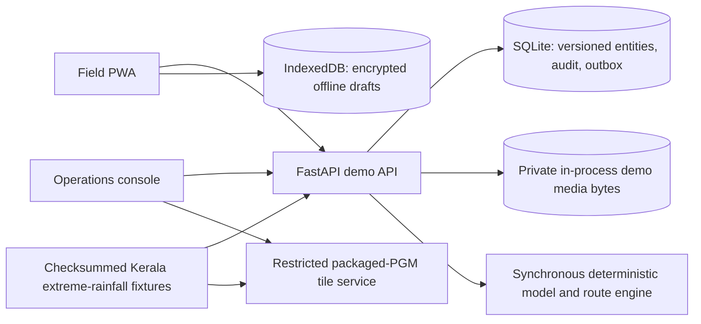

# floodRISE architecture

This document separates the target municipal topology from the runtime that is
actually present in this repository. The first diagram is a production design,
not deployment evidence. The deterministic judging runtime is shown separately
below.

## System boundary

floodRISE has two clients and one authoritative application boundary:

- The operations console supports map review, FloodSignal decisions, routing,
  shelters, approvals, resilience analysis, source health, and audit review.
- The field PWA supports privacy-minimized flood reports, offline queueing,
  cautions, receipts, and lower-risk route guidance.
- The versioned API owns authorization, validation, corroboration, approvals,
  audit events, and authoritative state. A client hiding a button is never an
  authorization control.

## Target production topology

The following diagram is the intended production boundary. CloudFront, WAF,
Cognito, PostgreSQL/PostGIS/pgRouting, SQS workers, Redis, S3, and a production
COG service are not part of the local judging request path. Terraform contains
a partial, un-applied scaffold for this topology; see
[IMPLEMENTATION_STATUS.md](IMPLEMENTATION_STATUS.md).

## Implemented judging topology

The default `pnpm dev` path does not use the Compose PostgreSQL, Redis, MinIO,
LocalStack, or mock-sink containers. They are optional local infrastructure
targets. The API persists authoritative demo entities, idempotency responses,
hash-chained audit events, and SSE outbox events in SQLite; SSE reads the durable
outbox directly. Clean demo photo bytes live only in process memory. The model
and route recalculation run synchronously in the API process. An approved action
creates a synthetic `DISPATCHED` alert record and audit event whose gateway is
`fake://notification-sink`; the code does not make a notification request.

## Target authoritative data flow

The intended production sequence is:

1. Capture a raw source artifact with checksum, acquisition time, licence, and
   `is_simulated` marker.
2. Normalize accepted records into PostGIS without altering the raw artifact.
3. Create an immutable simulation snapshot referencing exact input versions.
4. Publish COG/model manifests in production—or the checksum-pinned packaged
   raster manifest in the offline demo—then versioned impact, road, and shelter
   state.
5. Produce a route or action recommendation bound to evidence/model versions.
6. Bind any high-impact request and approval to that exact version and audience.
7. Write the domain change, hash-chained audit event, and outbox event in one
   transaction. SSE is an invalidation hint; clients refetch authoritative data.

Redis loss may slow delivery but must not lose authoritative state. S3 artifacts
are private. The tile facade accepts an allow-listed artifact identifier, not an
arbitrary URL, and is not attached to a public load balancer.

The repository provides normalized PostGIS source/snapshot/route tables and
Celery simulation/route worker entry points for the deployment scaffold. The
deterministic path still starts with checksum-pinned fixture data and stores
versioned JSON entities through SQLAlchemy; production query cutover, raw
provider capture, COG publication, worker dispatch scheduling, and a production
outbox dispatcher require an authorized deployment rehearsal.

The repository's lightweight tile service is deliberately demo-scoped. It
loads immutable, georeferenced PGM depth grids from the Kerala extreme-rainfall fixture,
verifies their SHA-256 checksums at startup, and renders nearest-neighbour PNG
tiles with model, artifact, validity, confidence, and provenance metadata. This
is an artifact-backed offline path, not a COG reader or TiTiler deployment. A
production release must provide and validate the separately deployed,
locked-down COG/TiTiler adapter before enabling production raster traffic.
Bootstrap layer descriptors name the allow-listed artifact and the standalone
restricted tile service; they do not advertise a backend-relative tile URL or
imply that FastAPI proxies raster traffic. The tile service base URL is a
deployment concern and its TileJSON endpoint remains
`/api/v1/raster/{artifact_id}/tilejson.json` on that service.

## Trust and safety boundaries

- The implemented path is demo-only and uses a dedicated simulated incident ID
  plus visible `is_simulated`/`DEMO DATA` labels. Separate live credentials,
  storage prefixes, and gateways are production requirements, not locally
  exercised capabilities.
- The local Compose network is `internal: true`; its alert sink has no host port
  or public egress. Demo notification configuration is fixed to `demo_log`.
- The Terraform target gives private ECS tasks no public IP or NAT route and
  declares private AWS endpoints. No AWS plan, apply, or network test is evidence
  in this repository.
- The backend is an OIDC **bearer-token resource server**. It validates signature,
  issuer, expiry, audience/client ID, and configured JWKS, and accepts
  `X-Demo-*` identities only in demo/test profiles. Terraform declares a public
  Cognito authorization-code client that can be used by a PKCE-capable client,
  but neither web app implements login, code exchange, token refresh, logout, or
  a secure HttpOnly session. Those are production activation gaps. Server-side
  roles are allow-listed from token claims.
- In non-demo bearer-token profiles, approval decisions require MFA plus
  phishing-resistant WebAuthn/FIDO/hardware evidence and a recent step-up
  assertion (five minutes by default). The API records non-secret `amr`, `acr`,
  `auth_time`, and a token-ID digest; missing or stale evidence fails closed.
  Demo headers inject visibly simulated authentication evidence so the judging
  flow can exercise the boundary without an identity provider.
- A requester cannot approve their own high-impact command. The approval binds
  action, audience, geometry, evidence version, model version, and a 15-minute
  expiry.
- The API removes identity/device/note/media fields from non-identity-admin report
  responses and uses a generalized public location. This is a response-level
  access boundary only: the current repository stores identity and evidence
  fields together in the same versioned report JSON and database. A separately
  permissioned identity store and audited join service remain production work.

## FloodSignal and routing invariants

A positive report is live-eligible only when accuracy is no worse than 100 m,
ingestion is within 45 minutes of observation, and future skew is at most five
minutes. Strong shared identifiers collapse reports into one evidence family.
Four eligible independent families, including two authenticated/verified or
trusted families, confidence at least 0.75, and no material contradiction may
produce `COMMUNITY_CORROBORATED`. That state is explicitly not official.

Routing excludes authorized closures, p50 depth at least 0.15 m, or p90 depth at
least 0.30 m. It returns up to three **lower-risk** estimates with version and
expiry, or a no-route result. It never describes a route as safe.

## Target availability and recovery

The local judging path is deterministic and has no upstream data-provider
dependency. The Terraform target has variables and preconditions for origin TLS,
Multi-AZ RDS/Redis, RDS continuous recovery, 35-day retention, deletion
protection, and cross-region recovery points. Those resources have not been
applied or restored. RPO 5 minutes and RTO 30 minutes remain objectives;
measured restore exercises—not HCL values—would be the acceptance evidence.

See [SAFETY.md](SAFETY.md), [PRIVACY_RETENTION.md](PRIVACY_RETENTION.md), and
[DEPLOYMENT_RUNBOOK.md](DEPLOYMENT_RUNBOOK.md) for operating controls.
